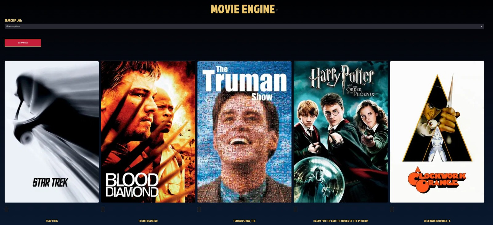
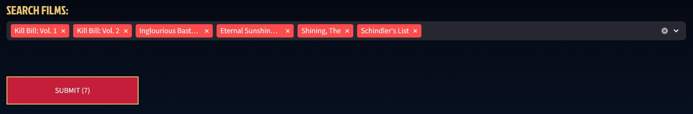
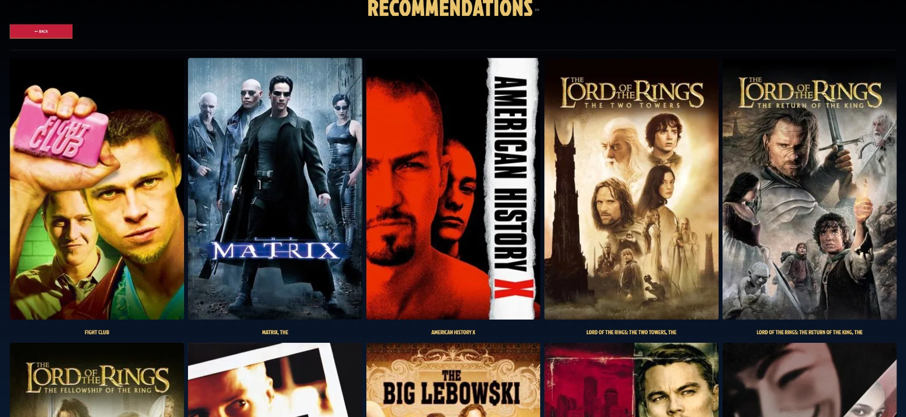
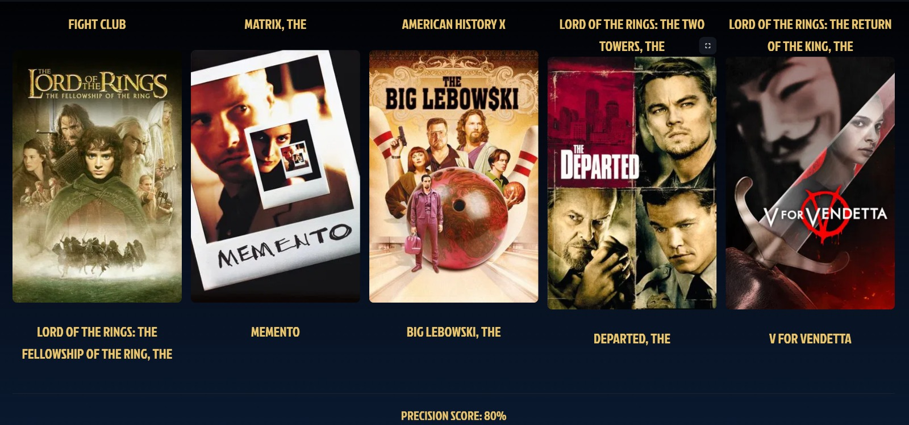

cat << 'EOF' > README.md
# MOVIE ENGINE (Recommendation System)

An interactive movie recommendation engine. This project uses Machine Learning to suggest movies based on user preferences.

## The Logic

This system uses a Hybrid Recommendation Approach:

* **Data Source**: We use the MovieLens dataset (movies.csv and ratings.csv).
* **Collaborative Filtering**: The engine looks at how thousands of other users rated movies. If many people liked both Movie A and Movie B, and you select Movie A, the system suggests Movie B.
* **KNN Algorithm**: We use NearestNeighbors with cosine similarity. It treats every movie as a point in a multi-dimensional space and finds the "closest" movies to your selection.

* **Multi-Selection Logic**: When you select multiple movies, the system calculates the neighbors for each one and sums up the "scores" to find the best common recommendations.
* **Smart Filtering**: The engine automatically removes the movies you already selected from the recommendation list, so you only see new discoveries.

## Evaluation

To measure how "accurate" the model is, I implemented a Genre-Match Precision Score:
* It compares the genres of your selected movies with the genres of the recommended movies.
* If the genres overlap significantly, the score is higher.

## Technical Stack

* **Frontend**: Streamlit (Python-based web framework)
* **Data Science**: Pandas, NumPy
* **Machine Learning**: Scikit-learn (NearestNeighbors)
* **API**: TMDB API (to fetch live movie posters)

## How the Movie Engine looks:

## How to Run Locally

1. **Clone the repo**:
   git clone https://github.com/somustafa/movierecc.git

2. **Install dependencies**:
   pip install -r requirements.txt

3. **Run the app**:
   streamlit run app.py

